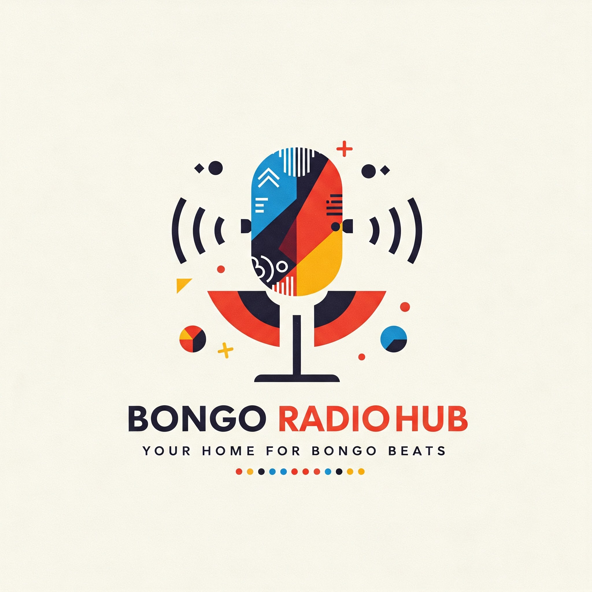

# Bongo Radio Hub



Welcome to **Bongo Radio Hub**, your home for streaming the best Bongo beats and radio stations from Tanzania! This project was developed as part of a Computer Science curriculum at Arusha Technical College (ATC) to explore web design and development while providing a fun and accessible platform for streaming publicly available radio stations.

## About the Project

Bongo Radio Hub is a free and open-source online radio streaming platform designed for educational purposes. It allows users to listen to various Tanzanian radio stations through a sleek and easy-to-navigate web interface.

This project is part of my learning curve in web design and programming, and I welcome community contributions to enhance its functionality and design.

## Features

### Radio Station Streaming
- Live streaming of Tanzanian radio stations
- Play/pause functionality
- Real-time audio playback
- Current station display with metadata

### Station Management
- Station list with search functionality
- Pin/unpin favorite stations
- Station cards showing:
  - Station name
  - Bitrate quality
  - Language
  - Listener count
  - Tags/categories
  - Station favicon/logo

### Voice Control Features
- Voice search for stations
- Voice commands for playback control
- Real-time speech recognition

### Recording Features
- Audio recording capability
- Download recorded audio
- Microphone permission handling
- Recording status indicators

### User Interface
- Responsive design for all screen sizes
- Dark theme with purple accent colors
- Animated components and transitions
- Loading states and skeletons
- Toast notifications for user feedback
- Collapsible now playing bar
- Modern, clean layout

### Navigation & Pages
- Home page with station list
- Privacy Policy page
- Terms of Service page
- Contact page
- Navigation bar with logo and links

### Technical Features
- React Query for data fetching
- Real-time error handling
- Pagination for station list
- Responsive image handling
- External links to social media
- Browser audio API integration

### Performance
- Lazy loading of stations
- Optimized image loading
- Efficient state management
- Smooth animations and transitions

### Accessibility
- ARIA labels
- Keyboard navigation
- Screen reader support
- Focus management

### Legal & Information
- Detailed Terms of Service
- Comprehensive Privacy Policy
- Attribution to radio stations
- Educational project context

## Getting Started

### Prerequisites
To run this project locally, you need:
- A modern web browser (Google Chrome, Firefox, or Safari).
- Node.js installed on your system.

### Installation
1. Clone the repository:
   ```bash
   git clone https://github.com/airiermonster/Bongo-Radio-Hub.git
   ```
2. Navigate to the project directory:
   ```bash
   cd Bongo-Radio-Hub
   ```
3. Install dependencies:
   ```bash
   npm install
   ```
4. Start the development server:
   ```bash
   npm run dev
   ```
5. To build the project for production:
   ```bash
   npm run build
   ```

## Changelog

### UI/UX Improvements
- Added Parkinsans as the default font family throughout the website
- Modernized the search bar design with improved visibility and styling
- Enhanced background colors and contrast
- Added smooth transitions and hover effects
- Updated placeholder text to "Search for radios here"
- Improved focus states

### Page Styling & Layout
- Fixed background styling for Privacy Policy, Terms of Service, and Contact pages
- Implemented consistent dark theme across all pages
- Added proper content structure and layout to legal pages

### Components
- Enhanced Footer component with:
  - Social media links
  - Contact information
  - Animated elements
  - Proper spacing and layout
- Improved NowPlaying component with:
  - Better visibility
  - Close button functionality
  - Smooth animations

### Animations
- Added various animations throughout the site:
  - Fade-in effects
  - Float animations for icons
  - Wave animations for decorative elements
  - Pulse effects for interactive elements

### Responsive Design
- Ensured proper responsive layout across all screen sizes
- Improved mobile navigation and accessibility

### Technical Updates
- Updated Tailwind configuration with new:
  - Colors
  - Animations
  - Font families
  - Custom utilities

## License

This project is licensed under the Apache 2.0 License. See the [LICENSE](https://github.com/airiermonster/Bongo-Radio-Hub/blob/main/LICENSE) file for more information.

## Contact

- **Name:** Maximilian Urio
- **X Profile:** [airiermonster](https://x.com/airiermonster)
- **Email:** airiermonster@gmail.com

Thank you for exploring **Bongo Radio Hub**! Your contributions and feedback make this project even better. Happy streaming!


